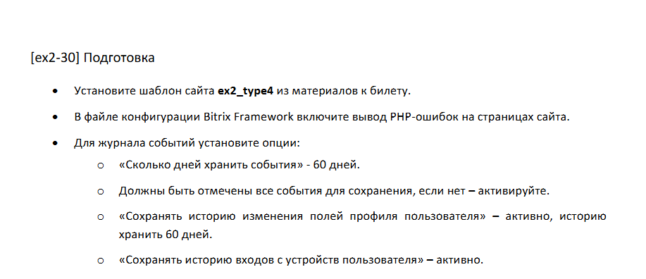
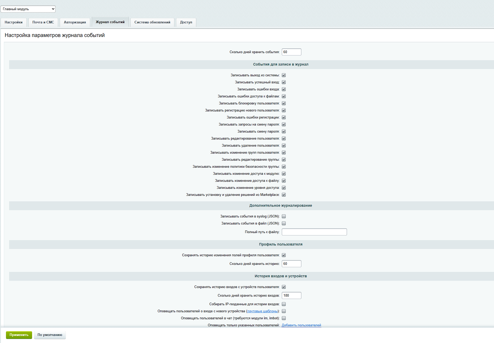
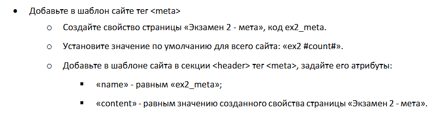
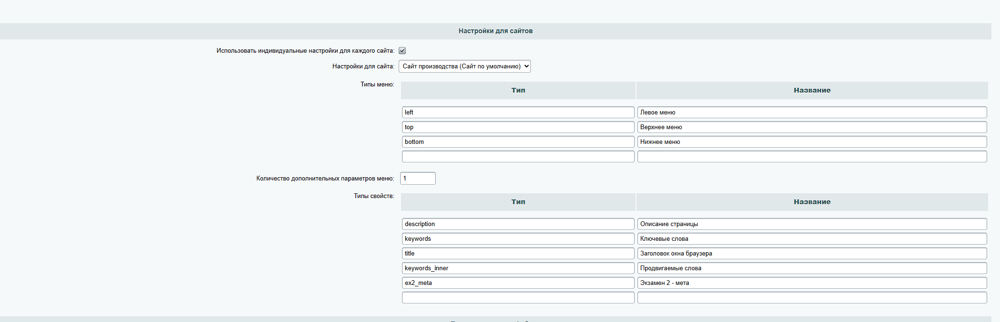
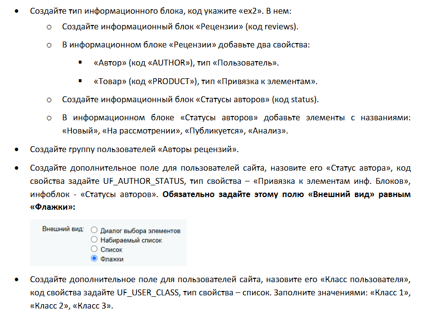

# 2exBitrix-New

Устанавливаем материалы в папку local/templates
Меняем шаблон в настройках сайта

В bitrix/.settings.php меняем в exception_handling debug на true

В настройках главного модуля настраиваем журнал событий

в шаблоне в <head>
<meta name="ex2_meta" content="<?=$APPLICATION->ShowProperty('ex2_meta'); ?>" />

и создаем свойство страницы в настройках модуля Управление структурой

